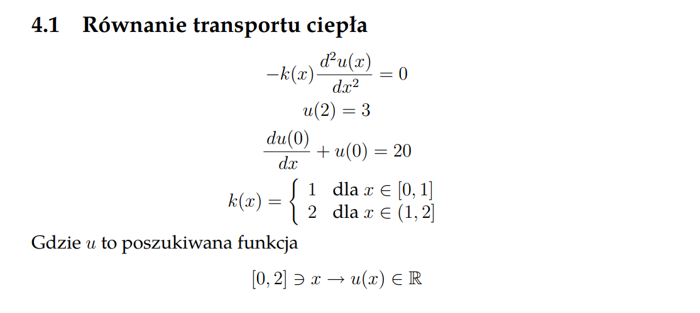

# Finite Element Method
An implementation of the finite element method in MATLAB, developed as part of the Differential and Difference Equations course at AGH University of Science and Technology. This project focuses on solving the heat transport equation using the finite element approach.

